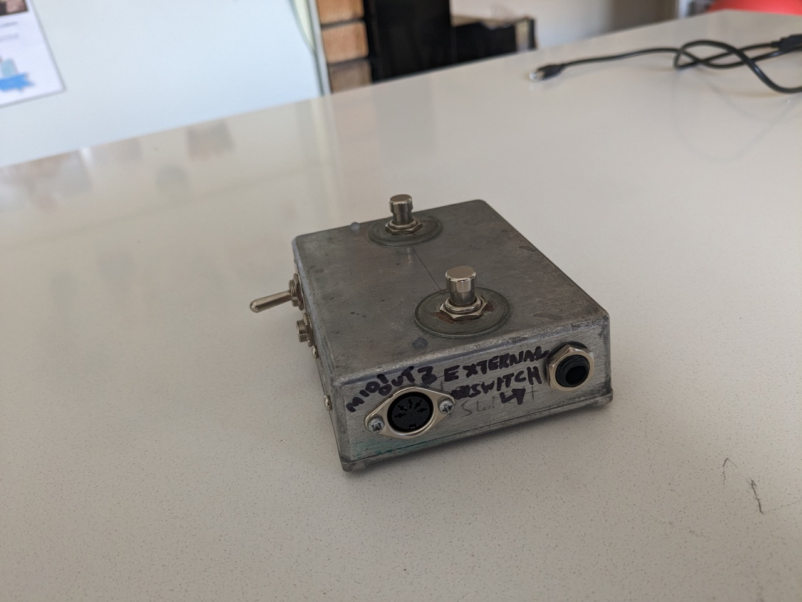

# Multi Foot Switch

A handy little Footswitch Box which can be used in 2 different ways:

- As a standard 2-Button Footswitch, which is connectable via a 6.35mm TRS cable and is switchable between Normally-Open or Normally-Closed mode.

- As a USB Midi controller, which sends Button presses as Notes. It can be expanded with another 1 or 2-Button Footswitch via TRS/TS. An Expression Pedal can also be connected, which is translated to Midi CC.

## Pics

